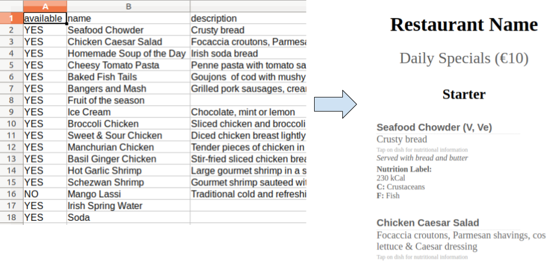

# CSV2Menu
Converts a CSV file into an elegant HTML to display your restaurant menu

## Features
* Daily Specials
* Sub-menus
* Allergens (EU standard)
* Calories

## Usage
`python3 csv2menu.py <CSV PATH> <RESTURANT NAME> <HTML OUTPUT PATH>`

Example:
    
    python3 csv2menu.py menu.csv 'Restaurant Name' output.html

## Dependencies
* Python3.8
* beautifulsoup4
* pandas

## Credit
Inspired by [piatto](https://github.com/dasmer/piatto)

## Authors
* [David Azcona](https://computing.dcu.ie/~dazcona/)
* [Juanjo Nieto](https://github.com/juanjo3ns)
* [Enric Moreu](https://enricmor.eu)